# SIEM Home Lab — Elastic Stack Threat Detection

A home lab simulating a real-world Security Operations Center (SOC) environment using the Elastic Stack (ELK). Built to demonstrate blue team skills including log ingestion, attack simulation, automated threat detection, and honeypot deployment.

## Project Overview

This project deploys a functional SIEM on a virtualized network, simulates SSH brute force and port scanning attacks, captures attacker activity via a honeypot, and detects threats using custom detection rules — mirroring workflows used in real SOC environments.

**Tools & Technologies**
- Elasticsearch 8.19 — log storage and search engine
- Kibana 8.19 — visualization and detection interface
- Filebeat 8.19 — log shipping agent
- Cowrie 3.0 — SSH honeypot
- Ubuntu Server 22.04 — SIEM host
- Kali Linux 2026.1 — attacker machine
- VirtualBox — virtualization platform
- Hydra — SSH brute force tool
- Nmap — port scanner

## Architecture

```
+---------------------+         +---------------------------+
|   Kali Linux VM     |         |    Ubuntu Server VM       |
|   192.168.56.1      |         |    192.168.56.101         |
|                     |         |                           |
|   Hydra (SSH BF)    +-------->|   SSH (port 22)           |
|   Nmap (Port Scan)  +-------->|   Cowrie Honeypot (:2222) |
|                     |         |   Filebeat                |
+---------------------+         |   Elasticsearch (:9200)   |
                                |   Kibana (:5601)          |
         Host-Only Network      +---------------------------+
         192.168.56.0/24
```

## What I Built

### Phase 1 — SIEM Infrastructure & Brute Force Detection
- Deployed Elasticsearch and Kibana on Ubuntu Server VM
- Configured Filebeat with the system module to collect auth logs
- Set up host-only network for isolated attack simulation
- Simulated SSH brute force attack using Hydra from Kali Linux
- Created custom threshold detection rule triggering High severity alerts

### Phase 2 — Port Scan Detection & Honeypot
- Installed and configured Cowrie SSH honeypot on port 2222
- Integrated Cowrie logs into Elasticsearch via Filebeat
- Simulated Nmap port scans and created detection rules
- Built a Kibana security dashboard with attack timeline, log breakdown, and top attacker IPs
- Deployed 4 simultaneous detection rules firing across different attack types

## Screenshots

### Elasticsearch Running
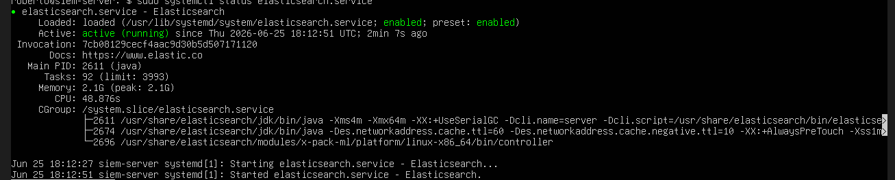

### Kibana Dashboard
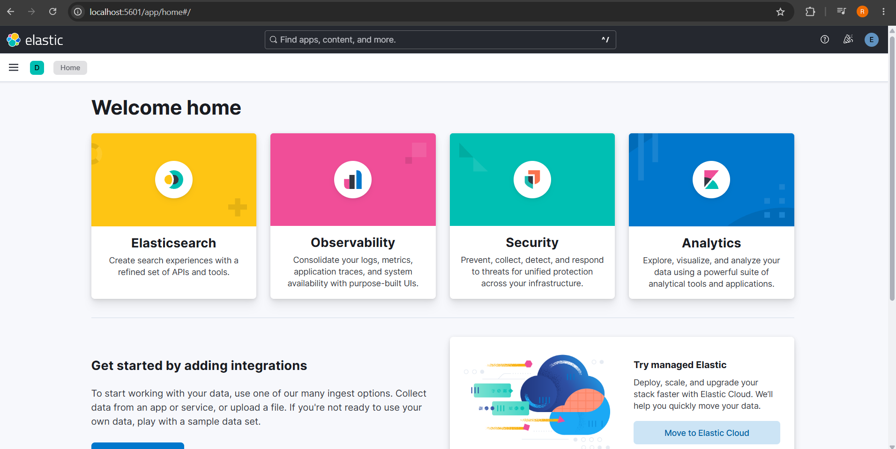

### Logs Flowing into Kibana
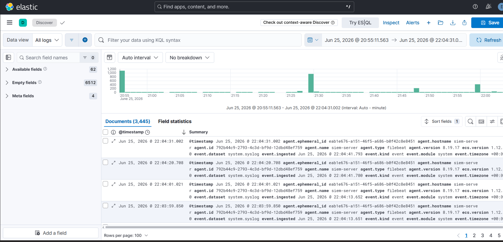

### Brute Force Attack Logs
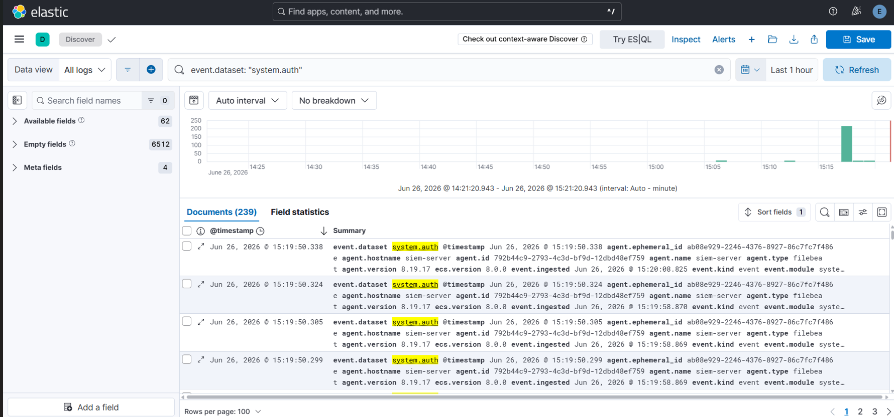

### Auth Log During Attack
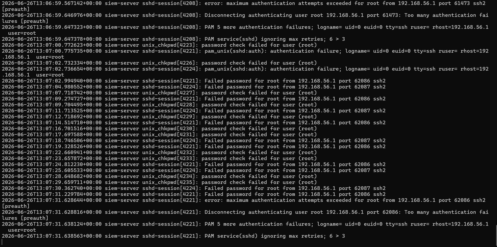

### Detection Rule Created
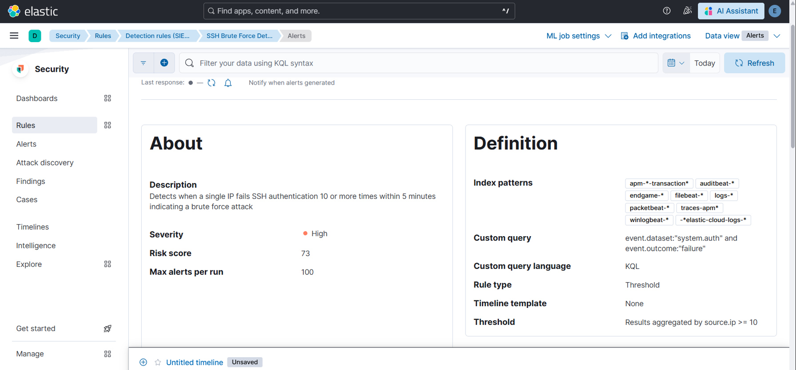

### SSH Brute Force Alert Triggered
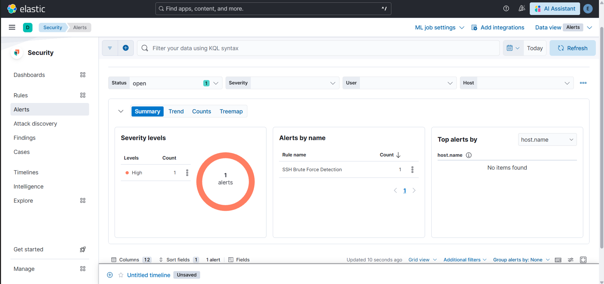

### Nmap Aggressive Scan
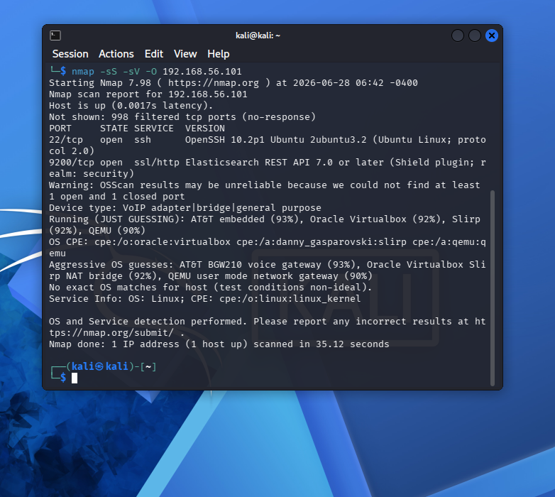

### Nmap Detection Rule
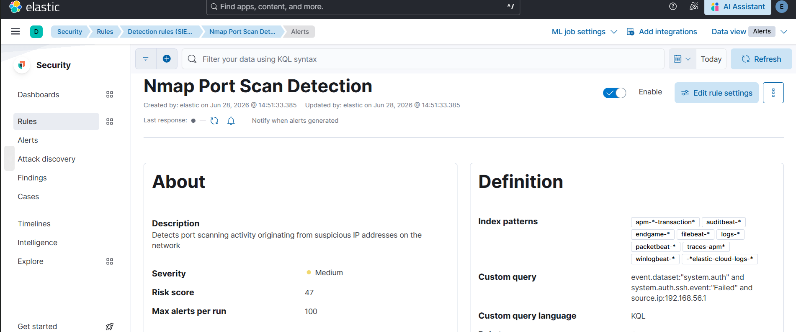

### Multiple Alerts Firing
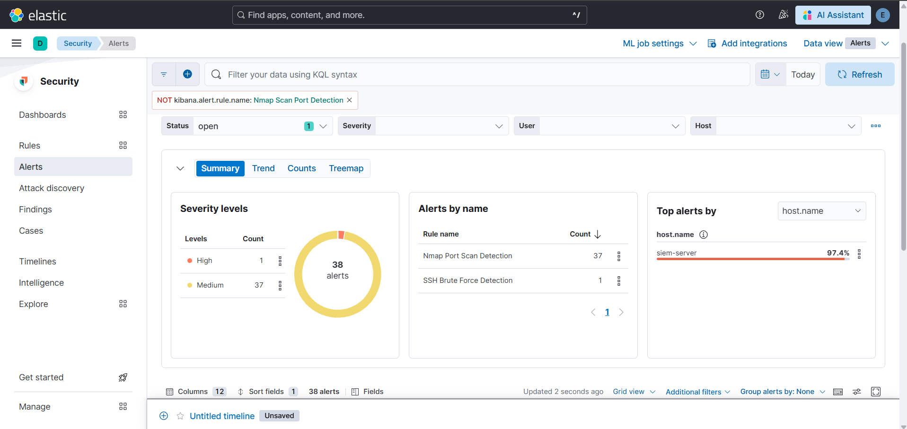

### Cowrie Honeypot Running


### Attacker View of Honeypot


### Cowrie Command Logs


### Cowrie Logs in Kibana


### Cowrie 31 Events in Kibana


### Honeypot Detection Rule


### Security Overview Dashboard
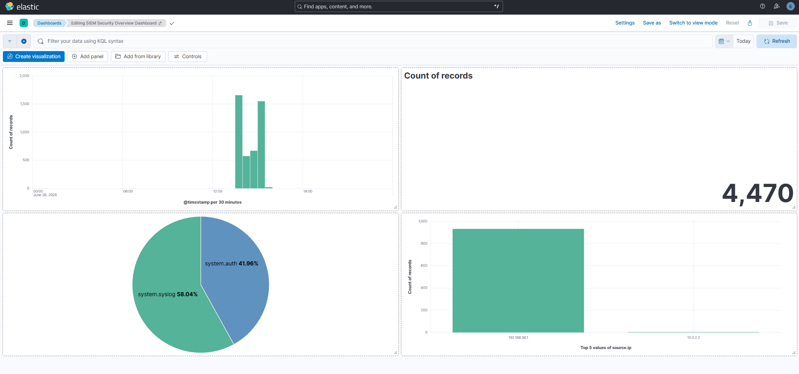

## Detection Rules

| Rule Name | Type | Query | Severity |
|---|---|---|---|
| SSH Brute Force Detection | Threshold | `system.auth.ssh.event:"Failed"` | High |
| Nmap Port Scan Detection | Custom Query | `system.auth.ssh.event:"Failed" and source.ip:"192.168.56.1"` | Medium |
| Honeypot Access Detected | Threshold | `tags:"cowrie" and eventid:"cowrie.login.failed"` | High |

## Key Skills Demonstrated

- SIEM deployment and configuration
- Log ingestion pipeline (Filebeat → Elasticsearch)
- Attack simulation in an isolated lab environment
- Custom detection rule creation in Kibana
- SSH honeypot deployment and log analysis
- Network port scan detection
- Security dashboard creation
- Linux server administration
- Network configuration (VirtualBox host-only adapter)
- Blue team / SOC analyst workflows

## Author

Roberto — Economic Informatics Student, ASE Bucharest
CompTIA Security+ Certified
GitHub: [Roberto2500](https://github.com/Roberto2500)
